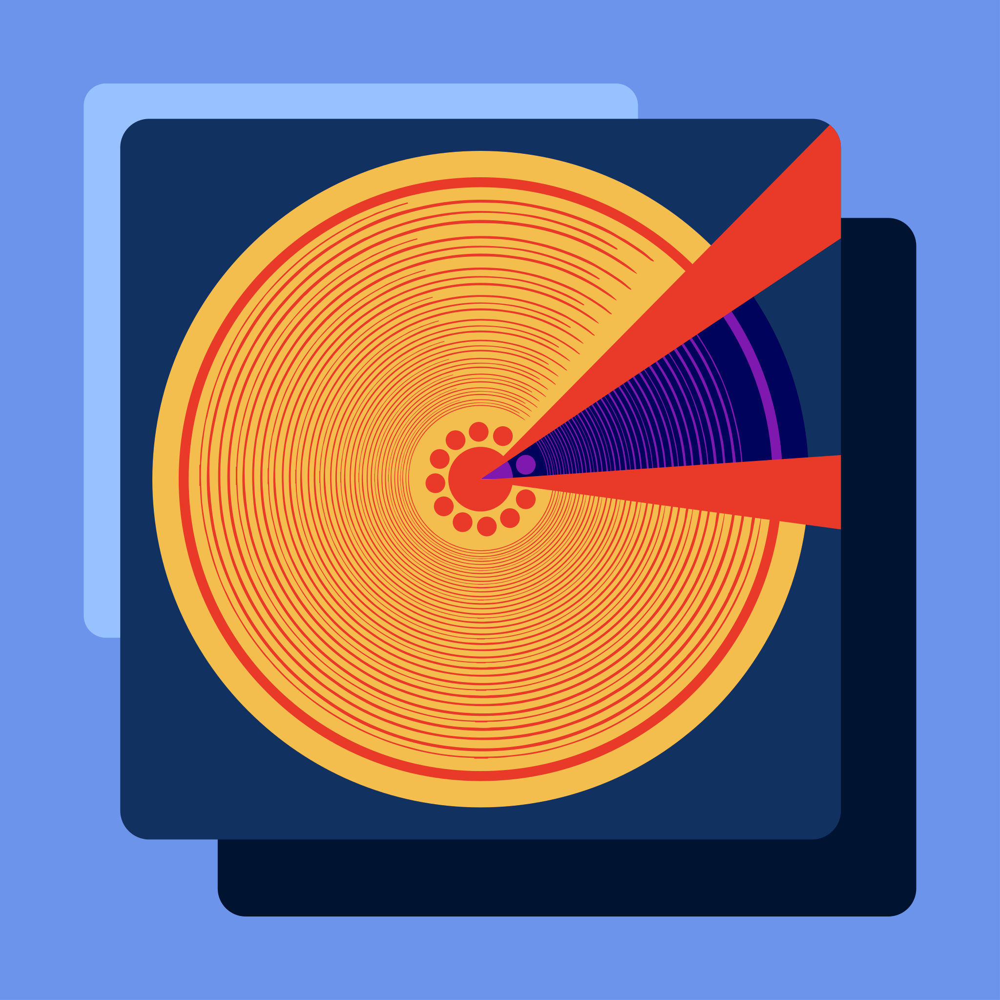
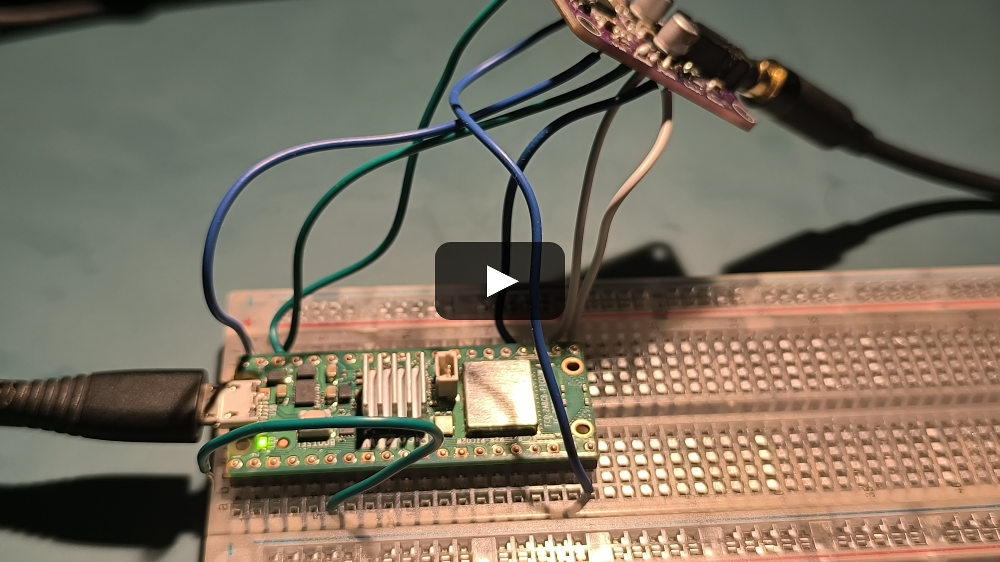
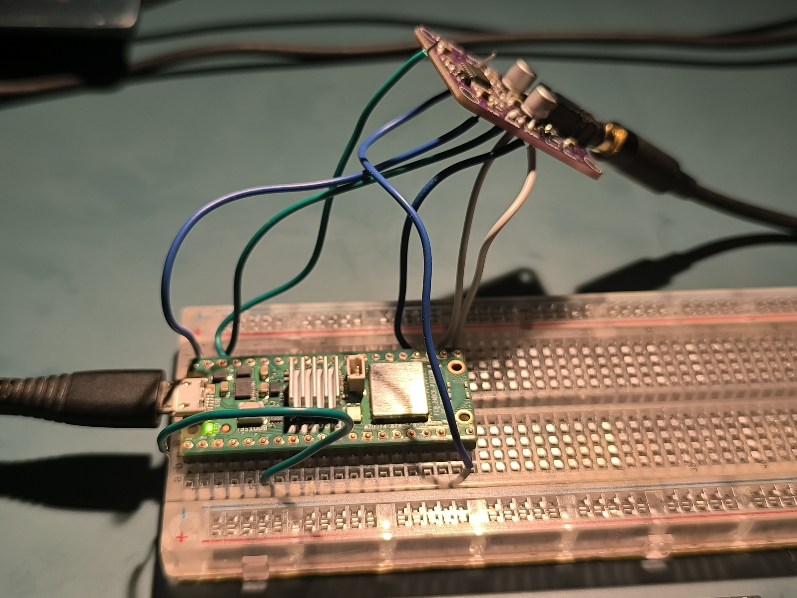
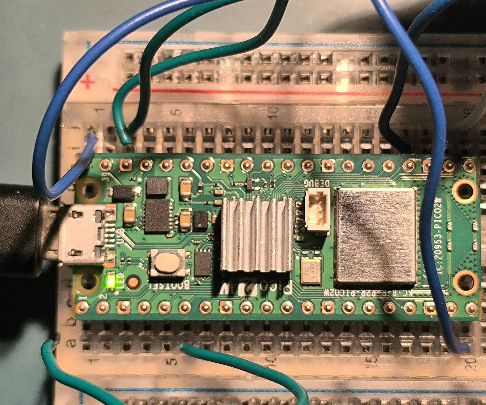
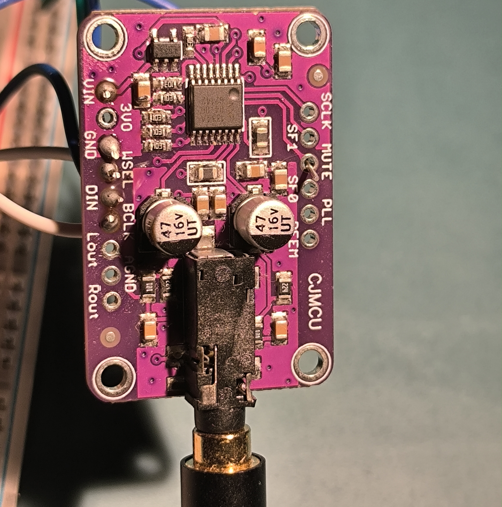

<p align="center">
  
</p>

<h1 align="center">picoaudio</h1>

<p align="center">
  
  
  
  
  
</p>

A Bluetooth A2DP audio receiver for the Raspberry Pi Pico 2 W. It receives Bluetooth audio and outputs 16-bit stereo PCM over I2S to a CJMCU-1334 (UDA1334A) DAC.

Built using the BTstack library and the Pico C/C++ SDK.

## Architecture & Features

- **Dual-Core Architecture:** Offloads the heavy SBC audio decoding entirely to Core 1 via a hardware-spinlock queue, ensuring that the Bluetooth stack on Core 0 never drops packets due to CPU starvation.
- **Ultra-Low Latency:** Optimized buffer sizes (I2S DMA and thread-safe queue) to achieve ~55ms total audio latency, perfect for lip-synced video playback.
- **Multipoint Bluetooth (Dual Device):** Supports 2 simultaneous A2DP and AVRCP connections. The firmware intelligently multiplexes incoming streams by maintaining independent connection states, decoding only the active stream, and dynamically switching to the standby device when the primary stream pauses. Volume is handled completely independently for each device.
- **A2DP Sink & SBC Decoder:** Receives SBC encoded audio (up to Bitpool 53 / ~328 kbps) and decodes it to 16-bit PCM stereo.
- **Hardware I2S Output:** Uses PIO and DMA to stream decoded audio to the I2S DAC at 44.1 kHz.
- **Drift Synchronization:** Implements dynamic software resampling (`btstack_resample`) to synchronize the incoming Bluetooth clock with the RP2350 hardware I2S clock, preventing buffer under/overflows.
- **Hardware Mute & AVRCP Volume:** Physical GPIO toggles hardware mute on the DAC. Processes AVRCP absolute volume commands and applies a logarithmic (quadratic) scaling function to the PCM data in software.
- **UI Sound Synthesizer:** Contains a blocking square-wave synthesizer that injects status tones directly into the I2S hardware pool on boot, connection, and disconnection events.

### Data Flow

```text
  ┌──────────┐     Bluetooth      ┌─────────────────────────────────────┐
  │          │   A2DP / SBC       │        Raspberry Pi Pico 2 W        │
  │  Phone   │ ─── ~328 kbps ──> │                                     │
  │          │   (wireless)       │  CYW43439 Radio                     │
  └──────────┘                    │       │                             │
                                  │       v                             │
                                  │ [CORE 0] BTstack (A2DP Sink)        │
                                  │       │                             │
                                  │       v (Thread-Safe Queue)         │
                                  │ [CORE 1] SBC Decoder (bitpool 53)   │
                                  │       │                             │
                                  │       v                             │
                                  │ [CORE 1] Volume Scaling (AVRCP)     │
                                  │       │                             │
                                  │       v                             │
                                  │ [CORE 1] DMA -> PIO I2S State Mach. │
                                  │       │                             │
                                  └───────┼─────────────────────────────┘
                                          │
                              GPIO 16 (BCLK)
                              GPIO 17 (WSEL)    I2S Bus (3 wires)
                              GPIO 18 (DIN)
                                          │
                                          v
                                  ┌───────────────┐
                                  │  CJMCU-1334   │
                                  │  (UDA1334A)   │
                                  │               │
                                  │  I2S -> DAC   │
                                  │       │       │
                                  │   3.5mm Jack  │
                                  └───────┼───────┘
                                          │
                                          v
                                    Speaker / Headphones
```

## UI Sound Configuration

The status tones are generated mathematically via `bt_audio.c`. Configuration is managed via preprocessor macros:

- `ENABLE_UI_SOUNDS` (default: `1`): Set to `0` to disable the synthesizer.
- `UI_SOUND_VOLUME` (default: `50`): Sets the 16-bit PCM amplitude of the square wave (max 32767).

## Hardware Requirements

| Component                 | Role                                |
| ------------------------- | ----------------------------------- |
| **Raspberry Pi Pico 2 W** | Main controller (RP2350 + CYW43439) |
| **CJMCU-1334** (UDA1334A) | I2S DAC                             |

## Wiring Guide

### Connection Diagram

```text
                    ┌──────────────────┐
              ┌─────┤ USB              ├─────┐
              │     └──────────────────┘     │
   UART0 TX ──┤ GP0  (1)        (40) VBUS   ├── 5V USB Power ──────> CJMCU VIN
   UART0 RX ──┤ GP1  (2)        (39) VSYS   │
              ┤ GND  (3)        (38) GND    ├── Ground ─────────────> CJMCU GND
 Play/Pause ──┤ GP2  (4)        (37) 3V3_EN  │
       Mute ──┤ GP3  (5)        (36) 3V3 OUT │
  Volume Up ──┤ GP4  (6)        (35) ADC_REF │
Volume Down ──┤ GP5  (7)        (34) GP28/A2 │
              ┤ GND  (8)        (33) GND     │
  Next Song ──┤ GP6  (9)        (32) GP27/A1 │
  Prev Song ──┤ GP7  (10)       (31) GP26/A0 │
    Pairing ──┤ GP8  (11)       (30) RUN     │
              ┤ GP9  (12)       (29) GP22    │
              ┤ GND  (13)       (28) GND     │
              ┤ GP10 (14)       (27) GP21    │
              ┤ GP11 (15)       (26) GP20    │
              ┤ GP12 (16)       (25) GP19    │
              ┤ GP13 (17)       (24) GP18    ├── I2S Data (DIN) ────> CJMCU DIN
              ┤ GND  (18)       (23) GND     │
              ┤ GP14 (19)       (22) GP17    ├── I2S WSEL ──────────> CJMCU WSEL
   DAC Mute ──┤ GP15 (20)       (21) GP16    ├── I2S BCLK ──────────> CJMCU BCLK
              └──────────────────────────────┘
                     Raspberry Pi Pico 2 W
```

### Pin Table

| Pico 2 W Pin | Physical Pin | CJMCU-1334 | Signal                |
| ------------ | ------------ | ---------- | --------------------- |
| **VBUS**     | 40           | **VIN**    | 5V USB Power          |
| **GND**      | 38           | **GND**    | Common Ground         |
| **GPIO 16**  | 21           | **BCLK**   | I2S Bit Clock         |
| **GPIO 17**  | 22           | **WSEL**   | I2S Word Select (L/R) |
| **GPIO 18**  | 24           | **DIN**    | I2S Serial Data       |

> [!NOTE]
> VBUS (5V) is used instead of 3V3. The Pico's switching 3V3 regulator introduces noise; feeding 5V to the DAC's onboard LDO provides cleaner power for the analog output.

### DAC Configuration Pins (CJMCU-1334)

Most breakout boards pull these low by default:

- **SF0 / SF1:** LOW (I2S format)
- **PLL:** LOW (Audio PLL mode)
- **DEEM:** LOW (De-emphasis OFF)
- **MUTE:** LOW (Mute OFF)

## Hardware Setup & Demo

### Project in Action

Here is the receiver in action! The Raspberry Pi Pico 2 W and the CJMCU-1334 DAC board are connected directly to a 2.1 channel sound system through the 3.5mm audio jack.

[](https://youtu.be/_wECP0X2Tsw)

### Wiring Closeups



<p align="center">
  
  
</p>

### Serial Logs

<video src="./assets/serial_logs_demo.mp4" controls="controls" width="100%">
  Your browser does not support the video tag.
</video>

## Download Latest Firmware

You can download the pre-compiled `.uf2` firmware from the latest successful build here:
[**Download Latest Firmware (pico-audio-firmware.zip)**](https://nightly.link/nicx17/picoaudio/workflows/build.yml/main/pico-audio-firmware.zip)

_(Extract the `.zip` to find the `.uf2` file, then follow the flashing instructions below)._

## Build Instructions

1. Install and configure the Raspberry Pi Pico C/C++ SDK for the RP2350.
2. Clone the repository.
3. Build the project:

```bash
mkdir -p build && cd build
cmake -DPICO_BOARD=pico2_w ..
ninja
```

## Flashing

1. Hold the **BOOTSEL** button on the Pico 2 W while plugging in the USB cable.
2. A mass storage device named `RP2350` will mount.
3. Copy the compiled `.uf2` binary to the device:

```bash
cp build/bluetooth_audio_receiver.uf2 /run/media/$USER/RP2350/
```

4. The Pico will automatically reboot. The Bluetooth device name is **Pico2W-Audio**.

## LED Status Indicator

| LED State      | Meaning                            |
| -------------- | ---------------------------------- |
| **1 Hz Blink** | Discoverable / Waiting for pairing |
| **4 Hz Blink** | Connected, no active audio stream  |
| **Solid ON**   | Connected, audio streaming         |
| **OFF**        | Initialization error               |

## Troubleshooting

| Symptom                     | Cause                    | Resolution                                        |
| --------------------------- | ------------------------ | ------------------------------------------------- |
| No LED blink on boot        | CYW43 init failure       | Verify USB power, reflash `.uf2`                  |
| Volume buttons unresponsive | AVRCP sync failure       | Re-pair the device; check UART logs for `[avrcp]` |
| Audio distortion            | Floating DAC config pins | Bridge SF0 and SF1 to GND on the DAC board        |

## References

- [Adafruit UDA1334A I2S Stereo Decoder Datasheet & Guide (PDF)](https://cdn-learn.adafruit.com/downloads/pdf/adafruit-i2s-stereo-decoder-uda1334a.pdf)

## License

Licensed under the MIT License. See `LICENSE` for details.
